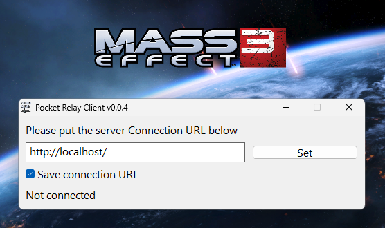

# PocketRelay Client Plugin


[Discord Server (discord.gg/yvycWW8RgR)](https://discord.gg/yvycWW8RgR)

## Table of Contents

- [What](#what) What Pocket Relay Embedded client is
- [Whats been improved](#whats-been-improved) The improvements over the original tool
- [Manually Building](#manually-building) Instructions for building manually
  - [Requirements](#requirements)
  - [1. Cloning sources](#1-cloning-sources)
  - [2. Adding rust target](#2-adding-rust-target)
  - [3. Building](#3-building)
  - [4. Done](#4-done)
- [Credits](#credits) Credit sources
- [License](#license) Project license

## 📌 EA / BioWare Notice

The **Pocket Relay** software in all its forms are in no way or form supported, endorsed, or provided by BioWare or Electronic Arts. 

The guide for using this plugin can be found [Here](https://pocket-relay.pages.dev/docs/client/plugin-client)

## What

This is a new iteration of the **PocketRelay** client to allow you to connect to **Pocket Relay** servers (Mass Effect 3 private servers). 
Rather than providing a seperate tool this version comes in the form of an ASI plugin that can be added to your games plugin folder
(Requires patching the game with ME3 Mod Manager or similar)



> This also works for the official servers because either closing, or just ignoring this popup window will cause the game to just connect to the official servers instead

## Whats been improved
- Program runs without admin permissions
    - The program is much safer and can be trusted much easier by the users now that it no longer requires any elevated permissions and doesn't modify any system files
    - This is also good for devices where the user doesn't have access to admin permissions
- Easier to use
    - Users no longer have to keep around a extra client utility, they just have to patch once then if they want to connect to a server they can enter its address and they're done
- Supports disconnecting (Experimental)
    - You can disconnect from a private server while the game is running and connect back to the official servers
    - There are a few bugs with this process so its recommened that you restart your game if you want to switch back to the official server
    - (Note: If you've connected back to the official servers you will have to restart your game before you can re-connect to private servers)
- Can close the window 
    - The connection URL window can be closed after you've connected to the server and doesn't need to be kept open like the previous client tool

## Manually Building

If you would like to manually build the dll you can follow the instructions below

### Requirements
- Git (Optional, but required if you want to clone the repository rather than manually downloading, skip the git steps if you are not using it)
- Rust, Cargo, Rustup (Requires minimum Rust version of 1.70 may not compile on older versions, Rustup is required to add the required i86 target)
- MSVC / Microsoft C++ Build Tools https://learn.microsoft.com/en-us/windows/dev-environment/rust/setup

### 1. Cloning sources

Clone github repository (Skip this step if you have manually downloaded the sources)

```sh
git clone https://github.com/PocketRelay/PocketRelayClientPlugin.git pocket-relay-client-plugin
cd pocket-relay-client-plugin
```

### 2. Adding rust target

You must add the following rust target to compile (The DLL requires being compiled for 32bit) you can add the target with the following rustup command

> This command only needs to be run for the first setup, and will be already installed for future builds

```sh
rustup target add i686-pc-windows-msvc
```

### 3. Building 

If you manually cloned the repository make sure you have cd'ed into the repository folder

```sh
cargo build --release
```

### 4. Done

The dll should now be built you can find it at

```
target/i686-pc-windows-msvc/release/pocket_relay_plugin.dll
```

## 🧾 License

MIT License

Copyright (c) 2023 Jacobtread

Permission is hereby granted, free of charge, to any person obtaining a copy
of this software and associated documentation files (the "Software"), to deal
in the Software without restriction, including without limitation the rights
to use, copy, modify, merge, publish, distribute, sublicense, and/or sell
copies of the Software, and to permit persons to whom the Software is
furnished to do so, subject to the following conditions:

The above copyright notice and this permission notice shall be included in all
copies or substantial portions of the Software.

THE SOFTWARE IS PROVIDED "AS IS", WITHOUT WARRANTY OF ANY KIND, EXPRESS OR
IMPLIED, INCLUDING BUT NOT LIMITED TO THE WARRANTIES OF MERCHANTABILITY,
FITNESS FOR A PARTICULAR PURPOSE AND NONINFRINGEMENT. IN NO EVENT SHALL THE
AUTHORS OR COPYRIGHT HOLDERS BE LIABLE FOR ANY CLAIM, DAMAGES OR OTHER
LIABILITY, WHETHER IN AN ACTION OF CONTRACT, TORT OR OTHERWISE, ARISING FROM,
OUT OF OR IN CONNECTION WITH THE SOFTWARE OR THE USE OR OTHER DEALINGS IN THE
SOFTWARE.